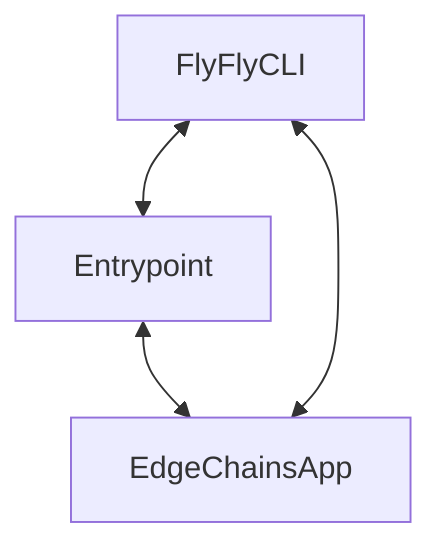

# EdgeChains : LLM chains on-the-edge
**chain-of-thought engineering for LLM and OpenAI GPT. Built for Java. Built for Enterprise. Built for Scale**
<div align="center">

  
  
  
  
  
  
  
  
  
  </div>
<div align="center">

  </div>
EdgeChains, a framework for building large-scale distributed machine learning systems. EdgeChains is built on top of JAX, and provides a number of features that make it well-suited for building distributed machine learning systems, including:

* **Automatic parallelism**: EdgeChains automatically parallelizes LLM chains & chain-of-thought tasks across CPUs, GPUs, and TPUs using the JVM.
* **Fault tolerance**: EdgeChains is designed to be fault-tolerant, and can continue to retry & backoff even if some of the requests in the system fail.
* **Scalability**: EdgeChains is designed to be scalable, and can be used to write your chain-of-thought applications on large number of APIs, prompt lengths and vector datasets.

## What does it look like ?

### EdgeChains Basic Architecture

EdgeChains is based on the Spring Framework. It uses the Spring Boot framework to provide a robust, scalable, and fault-tolerant architecture for building large-scale LLM Operation Systems.

The EdgeChainsApp is built from the `edgechain-app` directory, which contains all the required endpoints and methods to operate on LLMs. It is divided into three parts:
1. `app`: Contains the APIs that the user is going to directly communicate with. 
2. `lib`: Contains methods, classes and wrappers that are used by the `app` and `service` modules.
3. `service`: The APIs that the `app` uses. This has been made into a separate entity to facilitate the microservice architecture, without compromising on developer experience.

### TL;DR: Architecture Summary



<!--  -->

## Getting Started

Getting started with EdgeChains is easy. Just follow along!

### Clone the Repo

1. First, clone the EdgeChains Repo
```bash
git clone https://github.com/arakoodev/EdgeChains.git
cd edgechains
```

### Build the FlyFly CLI
2. Now, build the FlySpring CLI with Maven:

```bash
cd FlySpring/autoroute
mvn clean package -P gofly
cd ../flyfly
mvn clean package -P gofly
```
3. Now, the FlySpring JAR will be built inside the `Script/` directory

### Build the EdgeChains Example App
4. Now, build the EdgeChains Example App:

```bash
cd ../../edgechain-app
mvn clean package
```
Please wait till the EdgeChain App is built. This will take a while.


1. Now, copy the EdgeChains App Jar a directory of your choice. For the sake of simplicity, we will use the the `Script/` directory in our example:

```bash
cp target/edgechain-app-1.0.0.jar ../Script/
```

### Specifying an Entry Point

EdgeChains uses JBang, so you have to specify an entrypoint for EdgeChains to work. Right now, an entrypoint should be either called `EdgeChainApplication.java`, or `EdgeChainServiceApplication.java`.

For our example, you can find the examples in the `Examples/` directory - `EdgeChainApplication.java`, `EdgeChainServiceApplication.java` and `EdgeChainsFused.java`.

Copy these files to the `Script/` Directory:

### Running EdgeChains

#### Running through `EdgeChainsFused`

You can simply compile and run the `EdgeChainsFused.java` file to run the EdgeChains App:

```bash
javac EdgeChainsFused.java
java EdgeChainsFused
```
The logs would be stored in the `client_logs.txt` and `service_logs.txt` in the same directory.

#### Running Manually
You have to run EdgeChains in two terminals - one as a service, and in the another as an application using:

```bash
# In terminal 1 as a service
java -jar flyfly.jar jbang EdgeChainServiceApplication.java edgechain-app-1.0.0.jar
```
to start the service and
```bash
# In terminal 2 as an application
java -jar flyfly.jar jbang EdgeChainApplication.java edgechain-app-1.0.0.jar
```
to start the application.

## Usage

Here are a few fun tutorials that can help you get started!

### Document-based Chatting with EdgeChains

EdgeChains can be used to chat with a document. For example, you can chat with a document about the topic of "Bitcoin" or "Machine Learning". To do this, you can use the `EdgeChainService` class. 

1. First, fill up the `EdgeChainApplication.java` and `EdgeChainServiceApplication.java` files with the appropriate OpenAI and Redis credentials.
2. Then run the commands on two separate terminals:
  
  ```bash
  java -jar flyfly.jar jbang EdgeChainServiceApplication.java edgechain-app-1.0.0.jar
  ```

  and 

  ```bash
  java -jar flyfly.jar jbang EdgeChainApplication.java edgechain-app-1.0.0.jar
  ```
3. Now, you have to create a context for the chat. Think of it like a Chat Session in ChatGPT. You can do it by:
  ```bash
  curl  -X POST \
  'localhost:8003/v1/history-context/create' \
  --header 'Accept: */*' \
  --header 'User-Agent: Thunder Client (https://www.thunderclient.com)' \
  --header 'Content-Type: application/json' \
  --data-raw '{
    "maxTokens": 4096
  }'
  ```
You'll get a response like:

```json
{
  "id": "historycontext-571b0c2c-8d07-452b-a1d8-96bd5f82234e",
  "maxTokens": 4096,
  "message": "Session is created. Now you can start conversational question and answer"
}
```
Save the `id` somewhere. You'll need it later.

4. Now you need to upsert a document to EdgeChains. You can do it so by:

```bash
curl  -X POST \
  'localhost:8003/v1/redis/openai/upsert' \
  --header 'Accept: */*' \
  --header 'User-Agent: Thunder Client (https://www.thunderclient.com)' \
  --form 'file=@./8946-Article Text-12474-1-2-20201228.pdf'
```

5. Now, you can start chatting with the document. For example, we ask the question "What is the transformer architecture?". We do this by:

```bash
curl  -X POST \
  'localhost:8003/v1/redis/openai/query/context/<HISTORY_CONTEXT_VALUE>' \
  --header 'Accept: */*' \
  --header 'User-Agent: Thunder Client (https://www.thunderclient.com)' \
  --header 'Content-Type: application/json' \
  --data-raw '{
    "query": "What is the transformer architecture?"
}
'
```
Here is a demo using the famous research paper [**Attention is all you need**](https://arxiv.org/pdf/1706.03762.pdf):


## 🎊 Community

💫💫💫 **we would be very grateful if you could take 5 seconds to star our repository on Github. It helps get the word out to more LLM developers & open source committers about edgechains.** 💫💫💫

- Follow our [Twitter](https://twitter.com/arakoodev)
- Join  [Discord](https://discord.gg/MtEPK9cnSF) to write code, get help, or to chat with us!!!
- Open a [discussion](https://github.com/arakoodev/edgechains/discussions/new) with your question, or
- Open [a bug](https://github.com/arakoodev/edgechains/issues/new)
- Check open [Github Issues](https://github.com/arakoodev/edgechains/issues)
- Make sure to read our [contributing CLA](https://github.com/arakoodev/.github/blob/main/CLA.md).


## 🧐 Contributing Guidelines (There is only one)

This project hopes and requests for clean pull request merges. the way we merge is squash and merge. This fundamentally can only work if you **NEVER ISSUE A PULL REQUEST TWICE FROM THE SAME LOCAL BRANCH**. If you create another pull request from same local branch, then the merge will always fail.

solution is simple - **ONE BRANCH PER PULL REQUEST**. We Follow this strictly. if you have created this pull request using your master/main branch, then follow these steps to fix it:
```
# Note: Any changes not committed will be lost.
git branch newbranch      # Create a new branch, saving the desired commits
git checkout master       # checkout master, this is the place you want to go back
git reset --hard HEAD~3   # Move master back by 3 commits (Make sure you know how many commits you need to go back)
git checkout newbranch    # Go to the new branch that still has the desired commits. NOW CREATE A PULL REQUEST
```


## 💌 Acknowledgements

- First Hat tip to  [Spring](https://github.com/spring-projects/spring-framework).
- We are inspired by the spirit of [Nextjs](https://github.com/vercel/next.js/).
- All the other [contributors](https://github.com/wootzapp/wootz-browser/graphs/contributors).
- Respect to LangChain, Anthropic, Mosaic and the rest of the opensource LLM community. We are deeply grateful for sharing your knowledge and never turning anyone away.

## ✍️ Authors and Contributors

- Sandeep Srinivasa ([@sandys](https://twitter.com/sandeepssrin))
- Rohan Guha ([@pizzaboi21](https://github.com/pizzaboi21))
- Anuran Roy ([@anuran-roy](https://github.com/anuran-roy))

We love contributors! Feel free to contribute to this project but please read the [CLA](https://github.com/wootzapp/.github/blob/main/CLA.md) first!

<a href="https://github.com/arakoodev/edgechains/graphs/contributors">
  
</a>

## 📜 License

edgechains is open-source OSS software licensed under the MIT license.
