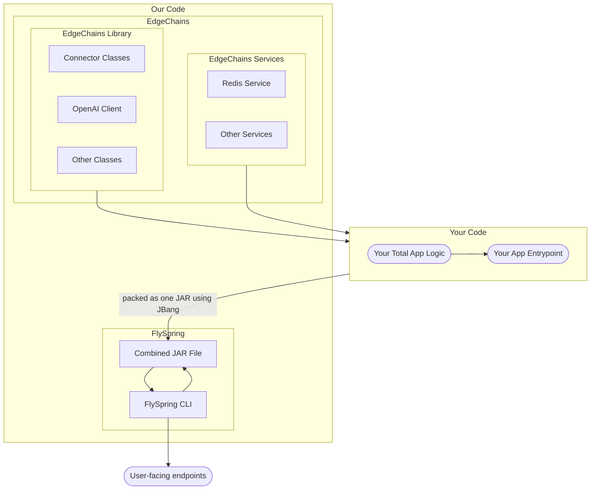

# EdgeChains : LLM chains on-the-edge
**We model LLM and Generative AI applications as a config management problem.  Edgechains fixes the broken dev-to-production lifecycle**
<div align="center">

  
  
  
  
  
  
  
  
  
  </div>
<div align="center">

  </div>
We believe that most modern Generative AI frameworks look at development as a UI or a code library problem. We look at it as a deployment and a configuration management problem. We think that most developers are in for a rude shock when calling the OpenAI api causes your code to blow up in complexity and your prompts to collapse under the weight of experimentation.
Edgechains is built on top of jsonnet - a library created by Google based on learnings from Borg, which runs 180 million lines of config code at Google. Jsonnet is used for large scale management of complex cloud and kubernetes clusters.
And building on top of this, Edgechains gives you:

* **Versioning for Prompts**: Prompts are written in jsonnet. Makes them easily versionable and diffable. 
* **Automatic parallelism**: EdgeChains automatically parallelizes LLM chains & chain-of-thought tasks across CPUs, GPUs, and TPUs using the JVM.
* **Fault tolerance**: EdgeChains is designed to be fault-tolerant, and can continue to retry & backoff even if some of the requests in the system fail.
* **Scalability**: EdgeChains is designed to be scalable, and can be used to write your chain-of-thought applications on large number of APIs, prompt lengths and vector datasets.

## Setup

You can get EdgeChains by either downloading the release jar or compiling it yourself. We recommend the former.

### Downloading the release jar

You can download the release jars from the [releases page](https://github.com/arakoodev/EdgeChains/releases). Download both flyfly.jar and edgechain-app-VERSION_NUMBER.jar.

### Compiling it yourself

There are 2 jar files to compile - `flyfly.jar` and `edgechain-app-1.0.0.jar`. You can compile EdgeChains yourself by following the instructions below:


1. Clone the git repository using:
  ```bash
  git clone https://github.com/arakoodev/EdgeChains.git
  ```
2. Go to the FlySpring repository using:

```bash
cd FlySpring
```

#### Compiling flyfly.jar

1. Compile the flyfly.jar file using:

```bash
cd autoroute
mvn clean package -P gofly
cd ../flyfly
mvn clean package -P gofly
```

The `flyfly.jar` file will be generated in the `Script` folder on the root directory.

### Compiling edgechain-app-VERSION_NUMBER.jar

1. Compile the edgechain-app-VERSION_NUMBER.jar file using:

```bash
cd edgechain-app
mvn clean package
```
The `edgechain-app-VERSION_NUMBER.jar` file will be generated in the `FlySpring/edgechain-app/target` directory.

## What does it look like ?

### Schematic for Quick Overview



### Integrating EdgeChains into your code

You can play around with the base EdgeChains library, or integrate it into your existing codebase as well! Just follow the instructions below:

1. Create a folder called `dependencies` in your root project folder, ie., the one having the `pom.xml`.

2. Place the `edgechain-app-VERSION_NUMBER.jar` app file in the `dependencies` folder.

3. Add the following to your `pom.xml` file:

```xml
<dependency>
    <groupId>com.edgechain</groupId>
    <artifactId>edgechain-app</artifactId>
    <version>VERSION_NUMBER</version>
    <scope>system</scope>
    <systemPath>${basedir}/dependencies/edgechain-app-VERSION_NUMBER.jar</systemPath>
</dependency>
```

4. Now you can run `mvn clean install`. This will install the EdgeChains library into your local maven repository.

### Running EdgeChains

Now, you can run EdgeChains as a service or as an application using jbang, like:

```bash
java -jar flyfly.jar jbang EdgeChainServiceApplication.java edgechain-app-1.0.0.jar
```
to start the service and
```bash
java -jar flyfly.jar jbang EdgeChainApplication.java edgechain-app-1.0.0.jar
```
to start the application.

## Usage

Here are a few fun tutorials that can help you get started!

### Document-based Chatting with EdgeChains

EdgeChains can be used to chat with a document. For example, you can chat with a document about the topic of "Bitcoin" or "Machine Learning". To do this, you can use the `EdgeChainService` class. 

1. First, fill up the `EdgeChainApplication.java` file with the appropriate OpenAI and Redis credentials.
2. Then run the command on the terminal:
  
  ```bash
  java -jar flyfly.jar jbang EdgeChainServiceApplication.java edgechain-app-1.0.0.jar
  ```

1. Now, you have to create a context for the chat. Think of it like a Chat Session in ChatGPT. You can do it by:
  ```bash
  curl  -X POST \
  'localhost:8080/v1/history-context/create' \
  --header 'Accept: */*' \
  --header 'User-Agent: Thunder Client (https://www.thunderclient.com)' \
  --header 'Content-Type: application/json' \
  --data-raw '{
    "maxTokens": 4096
  }'
  ```
You'll get a response like:

```json
{
  "id": "historycontext-571b0c2c-8d07-452b-a1d8-96bd5f82234e",
  "maxTokens": 4096,
  "message": "Session is created. Now you can start conversational question and answer"
}
```
Save the `id` somewhere. You'll need it later.

4. Now you need to upsert a document to EdgeChains. You can do it so by:

```bash
curl  -X POST \
  'localhost:8080/v1/redis/openai/upsert' \
  --header 'Accept: */*' \
  --header 'User-Agent: Thunder Client (https://www.thunderclient.com)' \
  --form 'file=@./8946-Article Text-12474-1-2-20201228.pdf'
```

5. Now, you can start chatting with the document. For example, we ask the question "What is the transformer architecture?". We do this by:

```bash
curl  -X POST \
  'localhost:8080/v1/redis/openai/query/context/<HISTORY_CONTEXT_VALUE>' \
  --header 'Accept: */*' \
  --header 'User-Agent: Thunder Client (https://www.thunderclient.com)' \
  --header 'Content-Type: application/json' \
  --data-raw '{
    "query": "What is the transformer architecture?"
}
'
```
Here is a demo using the famous research paper [**Attention is all you need**](https://arxiv.org/pdf/1706.03762.pdf):

[](https://s12.gifyu.com/images/SQ6y0.gif)

## 🎊 Community

💫💫💫 **we would be very grateful if you could take 5 seconds to star our repository on Github. It helps get the word out to more LLM developers & open source committers about edgechains.** 💫💫💫

- Follow our [Twitter](https://twitter.com/arakoodev)
- Join  [Discord](https://discord.gg/wgmvkVEKEn) to write code, get help, or to chat with us!!!
- Open a [discussion](https://github.com/arakoodev/edgechains/discussions/new) with your question, or
- Open [a bug](https://github.com/arakoodev/edgechains/issues/new)
- Check open [Github Issues](https://github.com/arakoodev/edgechains/issues)
- Make sure to read our [contributing CLA](https://github.com/arakoodev/.github/blob/main/CLA.md).


## 🧐 Contributing Guidelines (There is only one)

This project hopes and requests for clean pull request merges. the way we merge is squash and merge. This fundamentally can only work if you **NEVER ISSUE A PULL REQUEST TWICE FROM THE SAME LOCAL BRANCH**. If you create another pull request from same local branch, then the merge will always fail.

solution is simple - **ONE BRANCH PER PULL REQUEST**. We Follow this strictly. if you have created this pull request using your master/main branch, then follow these steps to fix it:
```
# Note: Any changes not committed will be lost.
git branch newbranch      # Create a new branch, saving the desired commits
git checkout master       # checkout master, this is the place you want to go back
git reset --hard HEAD~3   # Move master back by 3 commits (Make sure you know how many commits you need to go back)
git checkout newbranch    # Go to the new branch that still has the desired commits. NOW CREATE A PULL REQUEST
```


## 💌 Acknowledgements

- First Hat tip to  [Spring](https://github.com/spring-projects/spring-framework).
- We are inspired by the spirit of [Nextjs](https://github.com/vercel/next.js/).
- All the other [contributors](https://github.com/wootzapp/wootz-browser/graphs/contributors).
- Respect to LangChain, Anthropic, Mosaic and the rest of the opensource LLM community. We are deeply grateful for sharing your knowledge and never turning anyone away.

## ✍️ Authors and Contributors

- Sandeep Srinivasa ([@sandys](https://twitter.com/sandeepssrin))
- Rohan Guha ([@pizzaboi21](https://github.com/pizzaboi21))
- Anuran Roy ([@anuran-roy](https://github.com/anuran-roy))

We love contributors! Feel free to contribute to this project but please read the [CLA](https://github.com/wootzapp/.github/blob/main/CLA.md) first!

<a href="https://github.com/arakoodev/edgechains/graphs/contributors">
  
</a>

## 📜 License

edgechains is open-source OSS software licensed under the MIT license.
